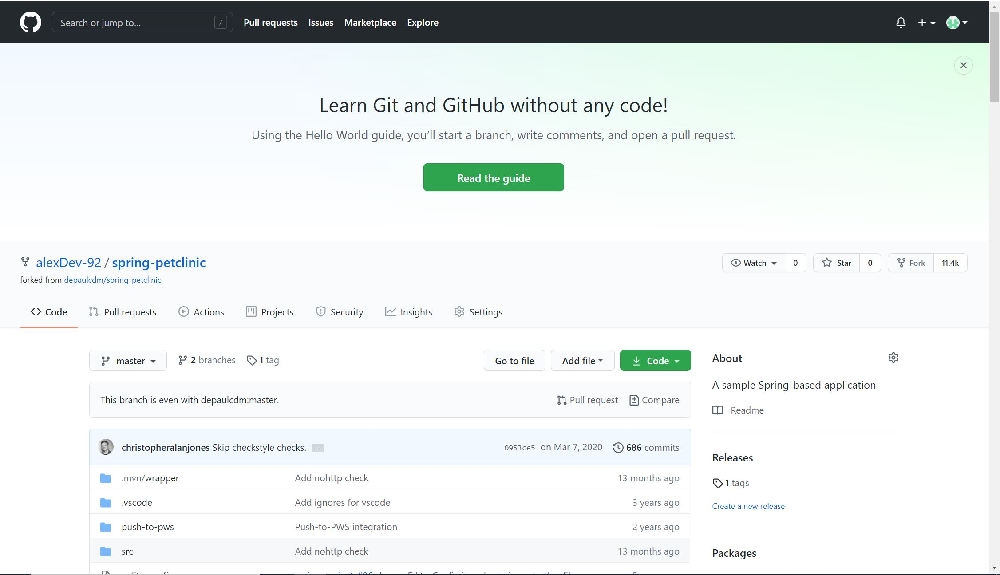
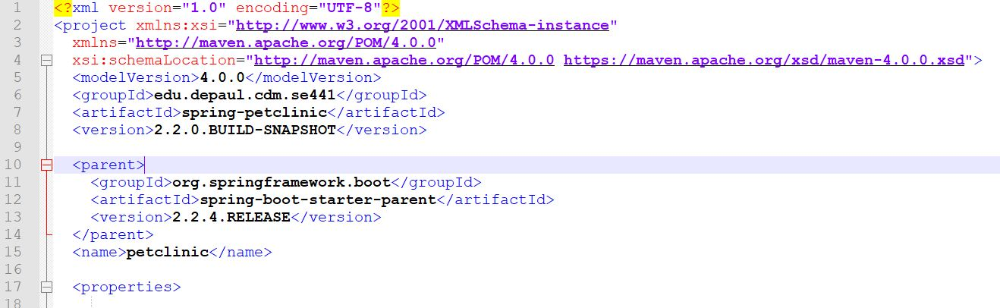
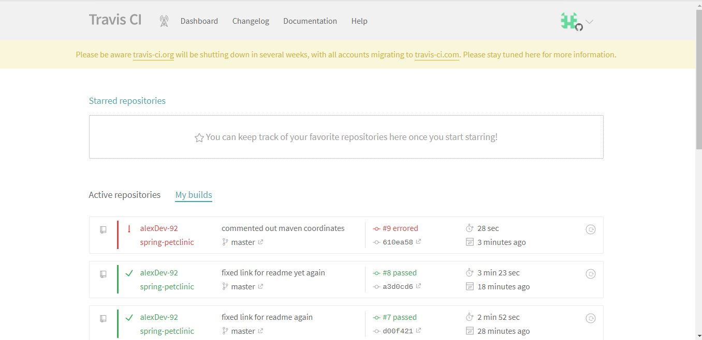
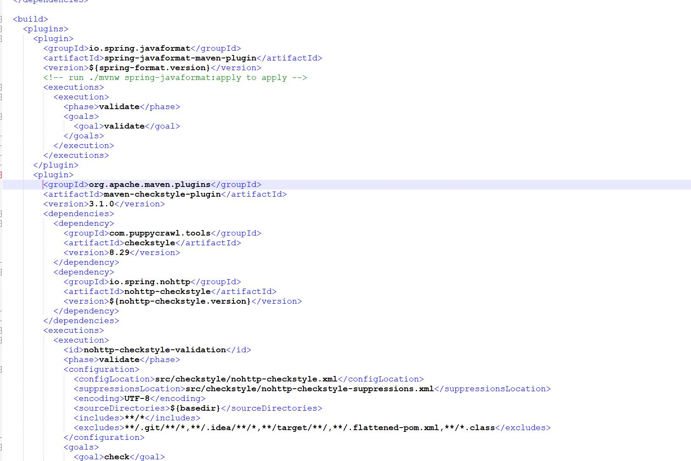

 

 

 

 

 

 

 

 

 

 
[Dockerfile](https://github.com/alexDev-92/spring-petclinic/blob/master/Dockerfile) 
 

 

 

 

 

 
[docker-compose.yml](https://github.com/alexDev-92/spring-petclinic/blob/master/docker-compose.yml)
 
[properties](https://github.com/alexDev-92/spring-petclinic/blob/master/src/main/resources/application-mysql.properties)
 

 
